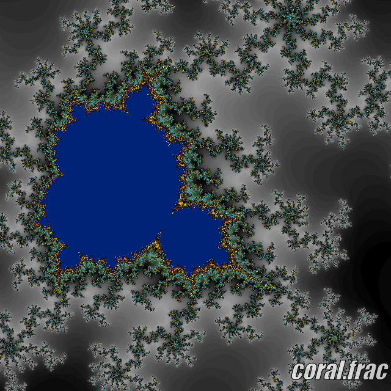
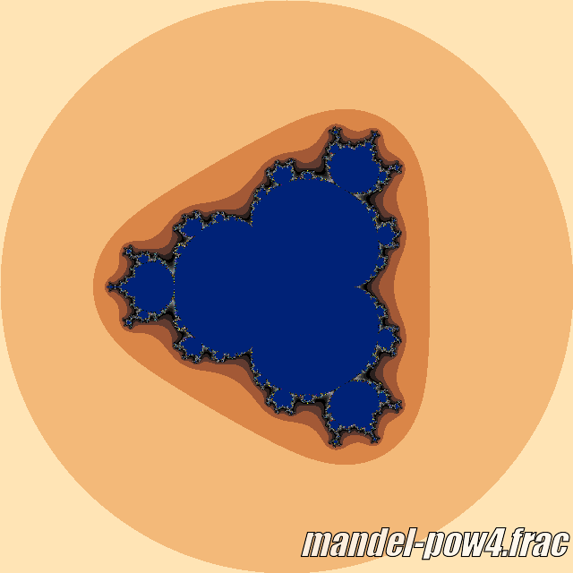
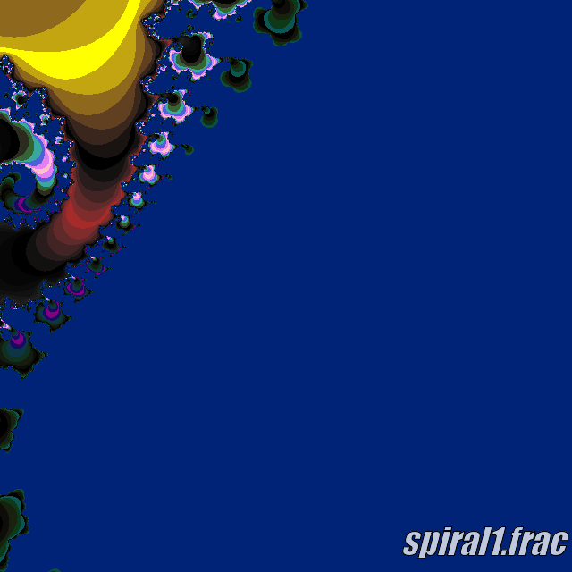

# CS 1440 Assignment 5.1: Design Patterns - Fractal Configuration Files

These files are not used in Assignment 5.0.  They will be used in Assignment 5.1.

The colors produced by your program will not match these samples.  This is because your color palettes differ from mine.  The overall shape should still be recognizable when you render these images with your program.  If your images lack definition, increase the contrast between colors in your palette.

## 8-points.frac

The characteristic Mandelbrot shape embedded within an 8-pointed compass

~~~config
type: Mandelbrot
centerY: -0.0
centerX: -1.999774061505
axisLength: 0.000000361314
iterations: 350
pixels: 1024
~~~

## braid.frac

A braid within the Newton set

You'll need to implement this formula yourself so your program can produce this image

~~~config
type: newton
pixels: 1368
axisLength: 0.232
centerX: -0.398
iterations: 200
centerY: 0.195
~~~

## branches@0064.frac

A branching spiral, rendered to 64 iterations

Don't adjust your screen - there really is nothing to see here

~~~config
type: mandelbrot
pixels: 640
iterations: 64
centerx: 0.354957789387306
centery: -0.338644137198173
axislength: 5.05822370716613e-06
~~~

## branches@0128.frac

A branching spiral, rendered to 128 iterations

More interesting than before

~~~config
type: mandelbrot
pixels: 640
iterations: 128
centerx: 0.354957789387306
centery: -0.338644137198173
axislength: 5.05822370716613e-06
~~~

## branches@0256.frac

A branching spiral, rendered to 256 iterations

Now we're getting somewhere!

~~~config
type: mandelbrot
pixels: 640
iterations: 256
centerx: 0.354957789387306
centery: -0.338644137198173
axislength: 5.05822370716613e-06
~~~

## branches@0512.frac

A branching spiral, rendered to 512 iterations

Mind == Blown

~~~config
type: mandelbrot
pixels: 640
iterations: 512
centerx: 0.354957789387306
centery: -0.338644137198173
axislength: 5.05822370716613e-06
~~~

## branches@1024.frac

A branching spiral, rendered to 1024 iterations

About as good as it gets - more iterations at this scale aren't worth the time

~~~config
type: mandelbrot
pixels: 640
iterations: 1024
centerx: 0.354957789387306
centery: -0.338644137198173
axislength: 5.05822370716613e-06
~~~

## burningship.frac

A basic Burning Ship fractal

You'll need to implement this formula yourself to make your program produce this image

~~~config
type: burningship
creal: -.598
cimag: .9225
centerx: 0
centery: 0
axislength: 3.7
pixels: 768
iterations: 96
~~~

## burningshipjulia.frac

A basic Burning Ship Julia fractal

You'll need to implement this formula yourself to make your program produce this image

~~~config
type: burningshipjulia
creal: -.598
cimag: .9225
centerx: 0
centery: 0
axislength: 4
pixels: 768
iterations: 128
~~~

## burningship-prow.frac

Burning Ship fractal zoomed in to very tip at the front

You'll need to implement this formula yourself so your program can produce this image

~~~config
type: burningship
creal: -.598
cimag: .9225
centerx: 1.80
centery: 0
axislength: 0.2
pixels: 768
iterations: 96
~~~

## burningship-stern.frac

Burning Ship fractal zoomed in to very back

You'll need to implement this formula yourself so your program can produce this image

~~~config
type: burningship
creal: -0.408
cimag: 1.9325
centerx: -0.85
centery: 1.40
axislength: 0.7
pixels: 768
iterations: 144
~~~

## connected.frac

A connected Julia set fractal

You'll need to implement this formula yourself so your program can produce this image

~~~config
type: julia
creal: .26
cimag: .0016
centerx: 0
centery: 0
axislength: 2.17
pixels: 512
iterations: 64
~~~

See also [unconnected.frac](#unconnectedfrac)

## coral.frac

This one reminds me of coral

~~~config
type: Mandelbrot
pixels: 1024
centerX: -0.693792639088625
centerY: -0.36850658033037173
axisLength: 0.005
pixels: 640
iterations: 512
~~~

## elephants.frac

Can you see elephants swinging their trunks?

~~~config
type: mandelbrot
pixels:     640
centerx:    0.3015
centery:    -0.0200
axislength: 0.03
iterations: 100
~~~

## enhance.frac

Enhance.  Enhance.  ENHANCE!!

~~~config
type: mandelbrot
pixels: 512
centerx: -1.48
centery: 0.0
axislength: 0.01
iterations: 300
~~~

## feathers.frac

Phoenix Fractal - Peacock tail

~~~config
type: phoenix
preal: -0.5
pimag: 0.0
creal: 0.5667
cimag: 0.0
centerX: -0.363287878200906
centerY: 0.381197981824009
axisLength: 0.0840187115019564
pixels: 512
iterations: 101
~~~

## fjords.frac

Maybe it's the shoreline of some fjords?

You'll need to implement this formula yourself so your program can produce this image

Found in http://bl.ocks.org/syntagmatic/raw/3736720/ with these parameters

Their rendering algorithm outputs this image upside-down relative to ours

~~~config
type: julia
cReal: -1.0125
cImag: 0.275
pixels: 512
centerx: -0.339230468501458
centery: 0.417970758224314
axislength: 0.164938488846612
iterations: 48
~~~

## hourglass.frac

I think this looks like an hourglass

You'll need to implement this formula yourself so your program can produce this image

~~~config
type: julia
creal: -1
cimag: 0
pixels: 1024
centerx: 0.618
centery: 0.0
axislength: 0.017148277367054
iterations: 78
~~~

## invalid.frac

This is a purposefully broken fractal config file.
Use this to stress-test your configuration file parser.

Here be dragons!

~~~config
Type: julia
centerX: in the middle
centerY
Iertations: 23.654
PIXELS: -256
cImag 0.3
Type: this is redundant
Type: no matter, this will all be forgotten in a moment
Type: BurningShipJulia
~~~

## julia-1.0.frac

The full julia set, but these creal and cimag values are BORING

You'll need to implement this formula yourself so your program can produce this image

~~~config
type: julia
creal: -1.0
cimag: 0.0
pixels: 1024
centerx: 0.0
centery: 0.0
axislength: 4.0
iterations: 78
~~~

## julia-1.1301.frac

The full julia set, but with different creal and cimag values

You'll need to implement this formula yourself so your program can produce this image

~~~config
type: julia
creal: -1.1301
cimag: 0.262
pixels: 1024
centerx: 0.0
centery: 0.0
axislength: 4.0
iterations: 78
~~~

## julia.frac

The full Julia set in all its glory

You'll need to implement this formula yourself so your program can produce this image

~~~config
type: julia
creal: -1.0125
cimag: 0.275
pixels: 1024
centerx: 0.0
centery: 0.0
axislength: 4.0
iterations: 78
~~~

## lace-curtains.frac
My grandmother has lace curtains that look JUST LIKE THIS!

You'll need to implement this formula yourself so your program can produce this image

~~~config
type:   Julia
pixels: 640
iterations: 256
centerX:   -1.0153
centerY:    0.2521
axisLength: 0.0121
cReal: -1.0
cImag: 0.0
~~~

## leaf.frac

Veins on a leaf.  I found this one in GNU XaoS.

~~~config
type: mandelbrot
pixels: 640
centerx:     -1.543577002
centery:     -0.000058690069
axislength:  0.000051248888
iterations: 96
~~~

## mandelbrot.frac

Basic mandelbrot set, fully zoomed out

~~~config
type: mandelbrot
pixels: 640
centerx: 0.0
centery: 0.0
axislength: 4.0
iterations: 100
~~~

## mandelbrot-zoomed.frac

Basic mandelbrot set, zoomed in a bit and with more iterations

~~~config
type: mandelbrot
pixels: 640
centerx: -1.0
centery: 0.0
axislength: 1.0
iterations: 256
~~~

## mandel-pow3.frac

Mandelbrot^3, fully zoomed out

You'll need to implement this formula yourself to make your program produce this image

~~~config
type: mandelbrot3
pixels: 640
centerx: 0.0
centery: 0.0
axislength: 4.0
iterations: 100
~~~

## mandel-pow4.frac

Mandelbrot^4, fully zoomed out

You'll need to implement this formula yourself to make your program produce this image

~~~config
type: mandelbrot4
pixels: 640
centerx: 0.0
centery: 0.0
axislength: 4.0
iterations: 100
~~~

## minibrot.frac

uWu... it's just so cute and TINY!

~~~config
type: mandelbrot
pixels: 1024
centerx: -1.40812110900879
centery: -0.136344909667969
axislength: 0.0028839111328125
iterations: 350
~~~

## monkey-knife-fight.frac

Phoenix Fractal: Monkey! Knife! Fight!

~~~config
type: Phoenix
preal: -0.5
pimag: 0.0
creal: 0.5667
cimag: 0.0
pixels: 512
iterations: 101
centerX: -0.945542168674699
centerY: 0.232234726688103
axisLength: 0.136626506024096
~~~

## newton.frac

Basic Newton set, fully zoomed out

You'll need to implement this formula yourself so your program can produce this image

~~~config
type: newton
pixels: 640
centerx: 0.0
centery: 0.0
axislength: 4.0
iterations: 100
~~~

## newton-zoomed.frac

Newton set, zoomed in to the center

You'll need to implement this formula yourself so your program can produce this image

~~~config
type: newton
pixels: 640
centerx: 0.0
centery: 0.0
axislength: 0.01
iterations: 100
~~~

## oriental-dragons.frac

Phoenix Fractal - A big European dragon composed of smaller Oriental dragons

~~~config
type: phoenix
creal: 0.57
cimag: 0.0
preal: -0.486
pimag: 0.0
pixels: 1024
iterations: 128
centerX: -0.611292072047808
centerY: -0.0428352613957943
axisLength: 0.0097572606582521
~~~

## phoenix.frac

Phoenix Fractal by Brock

~~~config
type: phoenix
preal: -0.5
pimag: 0.0
creal: 0.5667
cimag: 0.0
centerx: 0
centery: 0
axislength: 3.25
pixels: 512
iterations: 101
~~~

## rabbit-hole.frac

`Down the rabbit  h o l e   y  o  u       g     o`

~~~config
type:   mandelbrot
pixels: 640
iterations: 256
centerx: -0.76
centery: 0.117684887459807
axislength: 0.204501607717042
~~~

## seahorse.frac

I can sea the horse.  Can you?

~~~config
type: mandelbrot
pixels: 640
centerx:   -0.748
centery:   -0.102
axislength: 0.008
iterations: 384
~~~

## shrimp-cocktail.frac

Phoenix: Shrimp Cocktail

~~~config
type: Phoenix
preal: -0.5
pimag: 0.0
creal: 0.5667
cimag: 0.0
pixels: 512
iterations: 101
CENTERX: 0.529156626506024
CENTERY: -0.3516077170418
AXISLENGTH: 0.221204819277108
~~~

## spider.frac

Basic Spider set, fully zoomed out

You'll need to implement this formula yourself so your program can produce this image

~~~config
type: spider
pixels: 640
centerx: -1.0
centery: 0.0
axislength: 4.0
iterations: 100
~~~

## spider-island.frac

Spider island

You'll need to implement this formula yourself so your program can produce this image

~~~config
type: spider
pixels: 1024
centerx: 0.018
centery: 0.700
axislength: 0.25
iterations: 256
~~~

## spinneret.frac

The Spider's spinneret

You'll need to implement this formula yourself so your program can produce this image

~~~config
type: spider
pixels: 640
iterations: 245
centerX: -1.956
centerY: 0.0
axisLength: 0.1
~~~

## spiral0.frac

spiral0 from the original starter code

~~~config
type: mandelbrot
pixels: 640
centerx: -0.761335372924805
centery: 0.0835704803466797
axislength: 0.00497817993164062
iterations: 512
~~~

## spiral1@0256.frac

spiral1 from the original starter code, but rendered to 256 iterations

~~~config
type: mandelbrot
pixels: 640
centerx: -0.747
centery: 0.1075
axislength: 0.002
iterations: 256
~~~

## spiral1@0512.frac

spiral1 from the original starter code, but rendered to 512 iterations

~~~config
type: mandelbrot
pixels: 640
centerx: -0.747
centery: 0.1075
axislength: 0.002
iterations: 512
~~~

## spiral1@1024.frac

spiral1 from the original starter code, but rendered to 1024 iterations

~~~config
type: mandelbrot
pixels: 640
centerx: -0.747
centery: 0.1075
axislength: 0.002
iterations: 1024
~~~

## spiral1.frac

spiral1 from the original starter code

~~~config
type: mandelbrot
pixels: 640
centerx: -0.747
centery: 0.1075
axislength: 0.002
iterations: 100
~~~

## spiral-jetty.frac

An homage to Utah's official work of art

Have you ever visited the northeast shore of the Great Salt Lake?

~~~config
type: mandelbrot
pixels: 1024
centerx: -0.761335372924805
centery: 0.0835704803466797
axislength: 0.00497817993164062
iterations: 1024
~~~

## starfish.frac

Reminds me of a starfish... you can see it, too, right?

~~~config
type:   Mandelbrot
pixels: 640
iterations: 312
centerX: -0.463595023481762
centerY: 0.598380871135558
axisLength: 0.00128413675654471
~~~

## tip0.frac

A study of the tip of the Mandebrot set's main antenna

~~~config
type: Mandelbrot
pixels: 640
centerX: -1.789435
centerY: 0.0
axisLength: 1.9375
iterations: 100
~~~

## tip1.frac

A study of the tip of the tip of the Mandebrot set's main antenna

~~~config
type: Mandelbrot
pixels: 640
centerX: -1.789435
centerY: 0.0
axisLength: 0.9375
iterations: 100
~~~

## tip2.frac

A study of the tip of the tip of the tip of the Mandebrot set's main antenna

~~~config
type: Mandelbrot
pixels: 640
centerX: -1.789435
centerY: 0.0
axisLength: 0.09375
iterations: 100
~~~

## tip3.frac

A study of the tip of the tip of the tip of the tip of the Mandebrot set's main antenna

~~~config
type: Mandelbrot
pixels: 640
centerX: -1.789435
centerY: 0.0
axisLength: 0.009375
iterations: 100
~~~

## tip4.frac

A study of the tip of the tip of the tip of the tip of the tip of the Mandebrot set's main antenna

~~~config
type: Mandelbrot
pixels: 640
centerX: -1.789435
centerY: 0.0
axisLength: 0.0009375
iterations: 100
~~~

## unconnected.frac

An unconnected Julia set fractal

You'll need to implement this formula yourself so your program can produce this image

~~~config
type: julia
creal: .26
cimag: .0015
centerx: 0
centery: 0
axislength: 2.17
pixels: 512
iterations: 64

~~~

See also [connected.frac](#connectedfrac)

## wholly-squid.frac

*Ph'nglui mglw'nafh Cthulhu R'lyeh wgah'nagl fhtagn!*

~~~config
type: mandelbrot
pixels: 640
iterations: 256
centerx: -0.744740098129553
centery: 0.209610393372855
axislength: 0.00160629282219288
~~~

## x-marks-the-spot.frac

X Marks The Spot!

You'll need to implement this formula yourself so your program can produce this image

~~~config
type:   Julia
pixels: 640
iterations: 256
cReal: -1.0125
cImag: 0.275
centerX: -0.251833357526491
centerY: 0.202938441870375
axisLength: 0.0120869329407663
~~~

