# CS 1440 Assignment 5.0: Refactoring - Project Requirements

In this sprint you will refactor this program into a cleaner form while keeping the *original functionality* intact.  Resist the urge to improve this program in any way that would be noticed by a user!  Pure refactoring is about *preserving* existing functionality, even if that functionality is incorrect.  In the next sprint (Assignment 5.1) you will complete this project by enhancing the system with new capabilities.

_Do not go looking for some cleverly-hidden bug; there are no easter-eggs.  Refactor the starter code with the assumption that it works correctly._

*   [User Interface](#user-interface)
*   [Identify Code Smells](#identify-code-smells)
*   [Separate Code Into Modules](#separate-code-into-modules)
*   [Improve Readability](#improve-readability)
*   [Dealing With Complex Code](#dealing-with-complex-code)
*   [Run Tests To Ensure Quality](#run-tests-to-ensure-quality)
*   [Fractal Configuration Dictionaries](#fractal-configuration-dictionaries)
*   [Draft a UML Class Diagram Describing Your Design](#draft-a-uml-class-diagram-describing-your-design)
*   [Write a User's Manual Explaining How To Use Your Program](#write-a-users-manual-explaining-how-to-use-your-program)
*   [Program Performance](#program-performance)
*   [Output Examples](#output-examples)


## User Interface

Preserve the original user interface.  The only difference that is tolerated is that the order of the fractals listed in the usage message may be changed.

0.  When no argument is supplied to `main.py` all of the choices are displayed to the user:
    *   ```
        $ python src/main.py
        Please provide the name of a fractal as an argument
            phoenix
            peacock
            monkey-knife-fight
            shrimp-cocktail
            elephants
            leaf
            mandelbrot
            mandelbrot-zoomed
            seahorse
            spiral0
            spiral1
            starfish
        ```
1.  An invalid argument is reported as an error and is followed by the usage message:
    *   ```
        $ python main.py moustache
        ERROR: moustache is not a valid fractal
        Please choose one of the following:
            phoenix
            peacock
            monkey-knife-fight
            shrimp-cocktail
            elephants
            leaf
            mandelbrot
            mandelbrot-zoomed
            seahorse
            spiral0
            spiral1
            starfish
        ```
2.  Only lower-case arguments are accepted.  Capitalized fractal names are rejected:
    *   ```
        $ python main.py Mandelbrot
        ERROR: Mandelbrot is not a valid fractal
        Please choose one of the following:
            phoenix
            peacock
            monkey-knife-fight
            shrimp-cocktail
            elephants
            leaf
            mandelbrot
            mandelbrot-zoomed
            seahorse
            spiral0
            spiral1
            starfish
        ```
3.  Extra arguments are ignored
    *   ```
        $ python main.py mandelbrot extra arguments
        Rendering mandelbrot fractal
        [100% =================================]
        Done in 3.231 seconds!
        Wrote picture mandelbrot.png
        Close the image window to exit the program
        ```
4.  Image files are saved in the program's current working directory
    *   The name of the file is `fractal name` + `.png`
    *   Existing images are silently overwritten


## Identify Code Smells

Catalogue some of the code smells you encounter in `doc/Smells.md`.

0.  There are **10** code smells named in the document.
    *   You must find at least **one** instance of each.
    *   You may write more.
1.  For each instance of smelly code, name the file and the general location it was found.
2.  Quote a snippet of the offending source code.
3.  Explain why the passage of code is not very good.
4.  Describe how you will fix it.

[doc/Smells.md](../doc/Smells.md) has a list of the **10** code smells that you will find along with a template that you will fill out.


## Separate Code Into Modules

You begin this sprint with one driver program and two modules.  Finish this
sprint with a carefully organized *modular* program that is run from a single
*driver* script.  Each module encapsulates one aspect of the program and
provides a well-defined interface to the other modules that use it.  This
organization will enable you to easily add new functionality in the next
sprint.

It is good enough for each file to be a collection of functions and variables.
You _may_ use classes in these modules, but it is not a requirement in this
sprint.  Applying the Object-Oriented techniques of Inheritance and
Polymorphism is the goal of the next sprint.

In the end your project should include these six modules _at minimum:_

0.  `main.py`
    *   The driver; this file is the main entry point of the program
    *   A good driver program is brief. It will read like a table of contents, giving a brief summary of the key responsibilities of the program.
    *   Imports necessary modules to display a fractal on-screen and output a PNG image
    *   Deals with the command-line arguments
        *   Issues a usage message when incorrect arguments are given
1.  `FractalInformation.py`
    *   All fractal configuration data in the program is to be located in this module
    *   Define a single dictionary that holds both Mandelbrot and Phoenix configuration data
2.  `Mandelbrot.py`
    *   Contains a function which, when given a coordinate in the complex plane, returns the **iteration count** of the Mandelbrot function for that point
    *   Does not have anything to do with colors or `Palette`
3.  `Phoenix.py`
    *   Contains a function which, when given a coordinate in the complex plane, returns the **iteration count** of the Phoenix function for that point
    *   Does not have anything to do with colors or `Palette`
4.  `Palette.py`
    *   A color palette is an array of colors; colors are simple strings
    *   This file will contain two color palettes
    *   The following statements hold true for a color palette named `P`:
        *   When the Mandelbrot or Phoenix fractal function returns an **iteration count** of a point in the complex plane, the corresponding pixel is painted the color of `P[count]`
        *   Your program should never allow `count >= len(P)`
        *   Remember, neither `Mandelbrot.py` nor `Phoenix.py` should `import Palette`; find another way to share `len(p)` with their functions
5.  `ImagePainter.py`
    *   Creates a `Tk` window and a `PhotoImage` object
    *   The `PhotoImage` object stores the pixels of the image
    *   This module contains code capable of creating a PNG image file
    *   This is the only module which may import `tkinter`
    *   This is the only module which *uses* any code from `tkinter`

This diagram shows how the modules relate to each other:

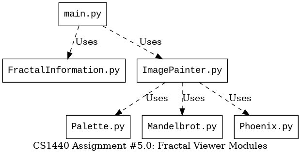

*Mind the capitalization of the filenames!*  Windows users may get away with
naming these files in lowercase, but your code **will break** when run on Mac
or Linux.

You are allowed to create new modules as you see fit.

When you are finished the files `mbrot_fractal.py` and `phoenix_fractal.py` are deleted.  **Do not leave these files in your repo!**


## Improve Readability

*   Erase or rewrite misleading comments.
*   Rename variables with bad names.
*   The functions' signatures aren't set in stone.
    *   If it makes sense to you to change a function's signature, go for it.
*   Simplify Confusing Constructs
    *   Remove or update comments which are no longer accurate or relevant
    *   Replace hard-coded magic numbers with well-named variables
    *   Rename carelessly-named variables so that the code is self-documenting
    *   Observe how data flows throughout the program and rewrite functions such that global variables are no longer necessary
*   Remove Dead Code
    *   You begin this sprint with two overlapping modules that contain redundant code.
        *   Identify passages of code that perform essentially the same tasks and rewrite them so that duplication is eliminated.
        *   But don't take this too far; if it takes three new lines of code to liberate one duplicated line, you're doing it wrong.
    *   When you find variables that are unused by a function, remove them
    *   When you find lines of code that have no effect, remove them
    *   Assignments to variables  _after_  they are read for the last time are unnecessary
    *   Code positioned after a return statement will never be reached, and can be deleted
    *   Function parameters which are unused in the body of a function can be deleted
    *   Functions which are never called and have no clear purpose can be deleted
*   Use Appropriate Data Structures
    *   The starter code uses a dictionary of dictionaries in a way that (shockingly) makes pretty good sense.
    *   You should retain this structure in your refactored program.
    *   Resist the urge to increase the level of nesting in this structure.
    *   You can add new key/value pairs to the inner dictionaries to keep track of which type of fractal they represent.
*   Use the Single Responsibility Principle
    *   Each function should deal with as few concepts as possible
    *   Identify functions which have too many responsibilities and split them into smaller pieces which are focused on one task
    *   Begin by identifying the inputs and outputs of each function
    *   The iteration count functions which define the fractals should not be concerned about which color a particular pixel will be; that combines two different responsibilities in a way that is not helpful.
        *   These functions must return only the iteration count, not colors!
    *   Reduce the number of `import` statements in each module to the minimum absolutely required to not crash.
        *   For example, all image creation and display operations should take place in  `ImagePainter.py`.  No other module needs to import anything from `Tk`.


## Dealing With Complex Code

The starter code is intentionally hard to follow, and will take time to understand.  Start early.  This program will begin to make sense as you read and rewrite it.

Use all of the tools at your disposal:

*   Rewrite the *Mandelbrot* and *Phoenix* algorithms in simplified pseudocode
    *   Save this in Phase 1 of `doc/5.0-Plan.md`
    *   You can use ChatGPT to help with this; cite it as a source in your Plan
*   The starter code works correctly
    *   If there are bugs, you must have put them there!
*   Make frequent, small commits in Git
    *   Test your changes before making each commit
    *   Then, you can discard your changes when you make a mistake
*   This program creates PNG images as a side-effect
    *   Make backups of these images *before* you modify the code
    *   This way you can [compare the program's output](#integration-tests) before and after your changes


## Run Tests To Ensure Quality

### Improve Coverage of Unit Tests

The starter code is supplied with six (6) unit tests.  Some of these tests
provided aren't helpful.  Other tests will need to be rewritten as you refactor
the programs.  Use the unit tests as your "canary in the coal mine" warning you
of mistakes.

*   Add two (2) new unit tests to increase the coverage over the program's functionality.
*   This means your submission must include at least eight (8) unit tests.
*   100% of the included unit tests must pass.
*   Unit tests that exercise useless code **do not count**
    *   For example, don't write a new function that serves no useful purpose just to increase the number of passing tests
*   At the end of the project, the example tests in `src/Testing/testAssertions.py` are not run by `src/runTests.py`


### I have no idea what to test!

The purpose of a Unit Test is to alert you when a change to your program unexpectedly causes a problem somewhere else in the program.  Here are some ideas of things you might test:

*   Ensure the color palettes of the expected length
*   Ensure the color palettes contain strings instead of some other type of data
*   Ensure that the dictionary of fractal configuration information contains the expected number of fractals
*   Ensure that each fractal configuration dictionary contains the expected keys, and that the corresponding values are all of the expected types
*   Ensure that your fractal's `count()` functions return *int* instead of other types

All of these may seem like insignificant, trivial tests, but should any one of these tests fail it would cause your program lots of trouble.  Wouldn't you want to be alerted if something changed and any one of these assumptions became false?


### Integration tests

Integration testing is done by analyzing the image files left behind by the program.

*   Make samples of the output images generated by the starter code *before* you make any changes to it.
    *   As you refactor the fractal algorithms your program should *always* produce identical images.
    *   When an output image differs from before, you will know you have made a mistake.
    *   There are pictures at the bottom of this document
        *   Because I've overlaid the image's title onto these pictures, they are not identical to the program's output
        *   You really need to make your own copies!
*   How can you tell if an image has changed?
    *   Eyeball it with an image display tool that lets you quickly flip back and forth between two images
    *   Use `cmp` to compare two image files from the command line:
        *   ```
            $ cmp mandelbrot.png before-mandelbrot.png
            mandelbrot.png before-mandelbrot.png differ: byte 99, line 3
            ```
        *   No output is printed when the files are identical 


## Fractal Configuration Dictionaries

The starter programs contain a dictionary holding parameters used by the
drawing routine to render an image of a region of the complex plane.  Each item
of this dictionary has a name which, when given on the command line, results in
that image being displayed.

When a missing or invalid argument is given to either program, the keys of this
dictionary are printed in a usage message instructing the user how to correctly
invoke the program.

Extract the contents of these dictionaries from the starter programs and unite
them in one dictionary in the `FractalInformation.py` module.  To distinguish
Phoenix fractals from Mandelbrot fractals add a new key/value pair to each
dictionary:

```
'type': 'phoenix',
```

or

```
'type': 'mandelbrot',
```

This piece of information will be used by your program to determine whether to
call the Mandelbrot or Phoenix function to choose the color of each pixel.

You may add new fractal configurations to the configuration dictionary.  Do not
remove the configurations present in the starter code as these images are used
when grading your submission.

Next sprint this program will be made to accept the name of a fractal
configuration file from the command-line so that one does not need to hack the
source code each time they want to produce a new image.  The GUI team has
translated the hard-coded fractal configurations into the sample configuration
files you will find in the `data/` directory.  You may disregard these files in
the first sprint of this project.


## Draft a UML Class Diagram Describing Your Design

You are working alongside another DuckieCorp team who is creating a
user-friendly GUI for our client's program (_not really, just pretend with me
here_). It helps them immensely to understand how your code is organized.
Submit a UML class diagram describing the modules, their relationships, and
the key functions/methods/data members involved.  You don't have to add
classes to your Python files in this sprint, but be aware that they will
required in the next sprint.

For purposes of this diagram, a Python module (a.k.a. a `.py` file) is
equivalent to a class.  You can draw the boxes as 3-part UML classes OR as UML
modules (if your drawing tool supports them).  You will convert these modules
into classes in the next assignment, so you may as well save time and draw them
as UML classes now.  Your UML diagram should use all of the features described
in Module 3 of the Lecture Notes repo on GitLab.

### Drawing UML Class Diagrams in Diagrams.net

[Diagrams.net](https://app.diagrams.net/) is a simple web app for making diagrams.  It is free, easy to use, and good enough for this project.

0.  Open the website
1.  Click "Create New Diagram"
2.  Select the "Basic" "Blank Diagram"
    *   Don't use one of the pre-defined UML templates, as they start with a bunch of placeholder junk that you'll just end up deleting
3.  Find the UML section in the accordion list on the left-hand side of the screen
    *   There are multiple shapes available with names like `Class`, `Class 2`, `Class 5`, etc.
    *   Make sure that the classes appearing on your diagram have 3 sections as described in our lectures:
    *   ```mermaid
        classDiagram
        direction LR
        class Classic {
            +field0 : type0
            +field1 : type1
            +method0() type0
            +method1() type1
        }
        ```
4.  Download your diagram as a PDF by clicking **File** -> **Export**.
    *   **Do not select _Transparent Background_**
5.  Click **Download** to create the PDF.  Depending on your browser, you may be redirected to a new tab from which you will need to save the file.


## Write a User's Manual Explaining How To Use Your Program

This won't be the final version of the program, and its command-line interface will change in the next sprint.  However, other non-programmer employees (e.g.  Quality Assurance testers, Client Services, Sales Demo Technicians, Technical Support) still need to be able to use this draft of the program.  There is a need for well-written instructions.  Your manual should be brief; between **1 or 2 kilobytes** of plain text is plenty, no larger than 4 kilobytes, please.

Commit your user's manual in your repository as a file named `doc/Manual.md`.  A final draft of the user's manual will be written next sprint, so give this some thoughtful consideration now.


## Program Performance

This program isn't going to win any races.  The equivalent C++ program is literally 10,000x faster than this one, generating a fractal in the blink of an eye.  There just isn't a lot of room for improvement without switching to a different programming language.  Making this program run faster isn't a high priority for you.  It is more important that you arrive at a clean, readable and maintainable solution than a fast one.

An additional complication is that the speed of this program is influenced by external factors that are not easy to change, such as your CPU and your operating system.  As much as I would like you to all switch to Linux, this is not feasible.

Instead, I provide this rough guide to the render times of each fractal so you can know what to expect.  If your computer is on the slow side, you should do most of your testing with the "fast" fractals.  The speed of each fractal in the table is proportional to the render time of `mandelbrot`; numbers less than one are faster than `mandelbrot`.

| Fractal              | Proportion of `mandelbrot`
|----------------------|---------------------------
| `leaf`               | 0.76x
| `phoenix`            | 0.81x
| `mandelbrot`         | 1.00x
| `monkey-knife-fight` | 1.29x
| `mandelbrot-zoomed`  | 1.64x
| `seahorse`           | 1.81x
| `peacock`            | 2.01x
| `shrimp-cocktail`    | 2.19x
| `spiral0`            | 2.41x
| `starfish`           | 2.94x
| `spiral1`            | 3.03x
| `elephants`          | 3.06x


## Output Examples

The following are images that the starter code is capable of producing.  As you refactor the program, ensure that your program's output continues to match these samples, down to the size of image and the color scheme.

Because these images include the fractal's name, comparisons against the output of your program will always show differences.  Create your own collection of sample images before you begin refactoring the program to make comparisons with.


### Phoenix

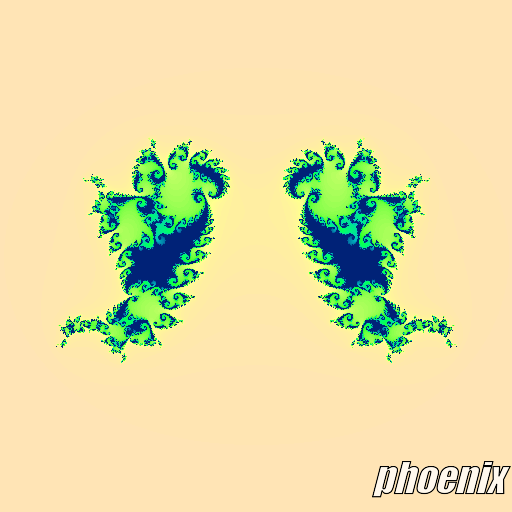


### Peacock

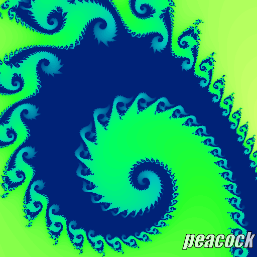


### Monkey! Knife! Fight!

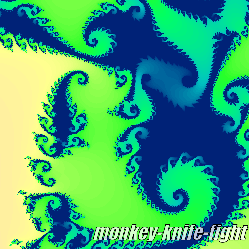


### Shrimp Cocktail

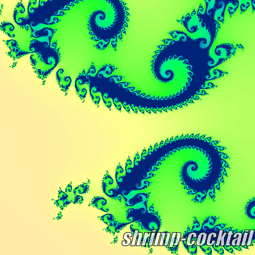


### Elephants

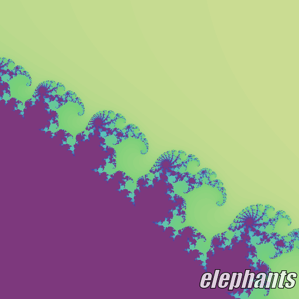


### Leaf

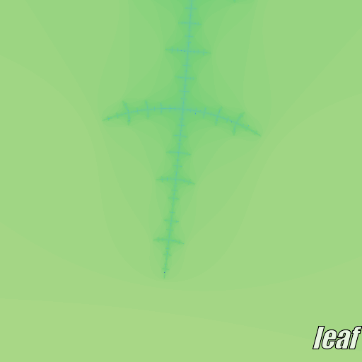


### Mandelbrot

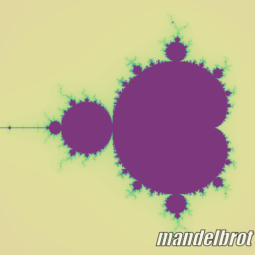


### Mandelbrot, Zoomed

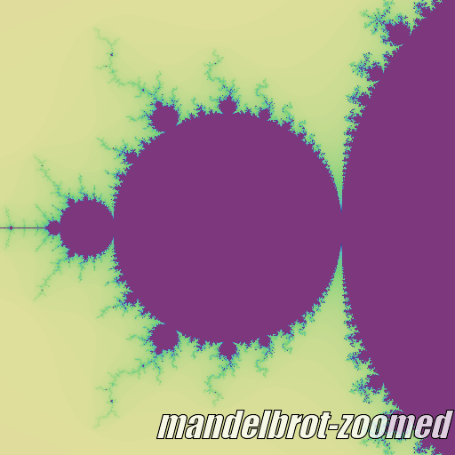


### Seahorse

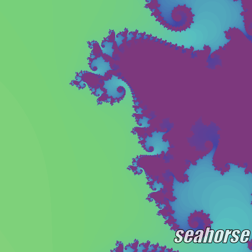


### Spiral #0

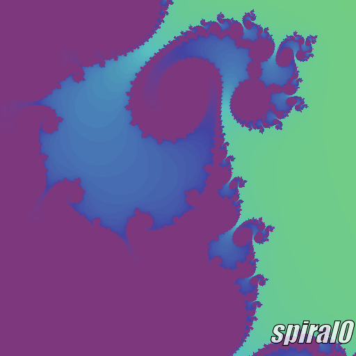


### Spiral #1

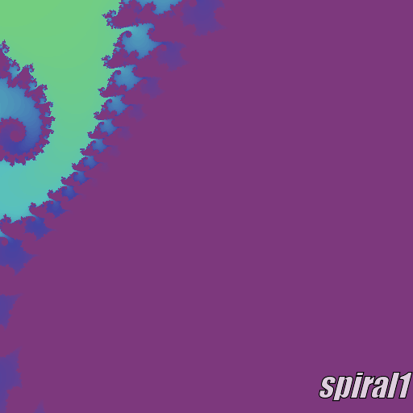


### Starfish

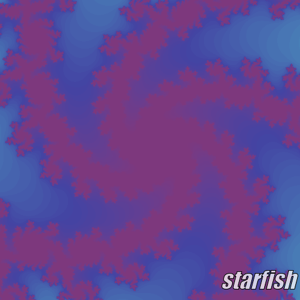
