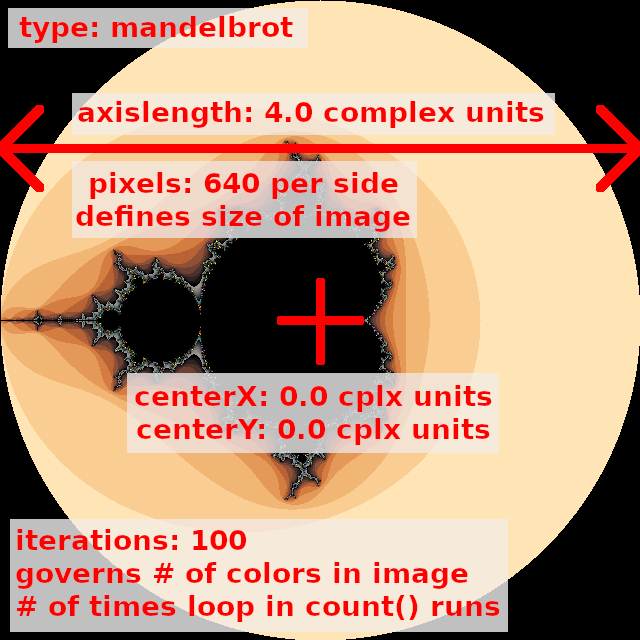

# CS 1440 Assignment 5.1: Design Patterns - Project Requirements

Take this fractal generating program to the next level by applying good principles of *Object-Oriented Design*.  Shape this into a program that will stand the test of time by being easy to test, modify and extend.

Additionally, because your program accepts input files in a standard format, you will be able to share your fractal creations with your classmates.

After successfully refactoring your client's program into a form which is easier to work on and think about, you are ready to take this program to the next level.  In this sprint you will apply the [Strategy](https://sourcemaking.com/design_patterns/strategy) and [Factory Method](https://sourcemaking.com/design_patterns/factory_method) design patterns.  Through judicious use of this design pattern your program will evolve from being merely maintainable to easily extensible.  A little bit of planning and energy spent now will set the stage for many years of smooth maintenance in the future.

*   [Documentation](#documentation)
*   [Unit Tests](#unit-tests)
*   [Fractal Classes](#fractal-classes)
*   [FractalFactory](#fractalfactory)
*   [FractalParser](#fractalparser)
*   [Palette Classes](#palette-classes)
*   [PaletteFactory](#palettefactory)
*   [ImagePainter](#imagepainter)
*   [User Interface](#user-interface)
*   [Default Fractal](#default-fractal)
*   [Fractal Configuration File Format](#fractal-configuration-file-format)
*   [How Long Should My Program Take To Finish?](#how-long-should-my-program-take-to-finish)
*   [The `abc` Abstract Classes Library](#the-abc-abstract-classes-library)
*   [Data Files For The Mandelbrot And Phoenix Fractals](#data-files-for-the-mandelbrot-and-phoenix-fractals)
*   [More Fractal Formulae](#more-fractal-formulae)


## Documentation

*   Update all of the documentation created for the previous assignment (UML, user's manual, etc.) so that it is congruent with the final product.
*   The names of all possible color palettes *must* be listed in the user's manual.
    *   This version of the program does not print a usage message.
    *   The manual is the **only** way the user will know how to run your program!


## Unit Tests

*   Provide eight (8) meaningful, non-trivial unit tests that pass.
*   See the section [Run Tests To Ensure Quality](./5.0-Requirements.md#run-tests-to-ensure-quality) from the last sprint for details


## Fractal Classes

Define a `Fractal` abstract class and at least *four* concrete subclasses

-   The `Fractal` abstract class exists solely to provide a common structure to the concrete classes that inherit from it.
    -   Your program will not create plain `Fractal` objects.
    -   Instead, derive child classes from `Fractal` through inheritance.
-   `Fractal` provides a placeholder `count()` method which raises an exception when called.
    -   It consists solely of this statement:
        ```python
        raise NotImplementedError("Concrete subclass of Fractal must implement count() method")
        ```
-   You are allowed (but not required) to define data members in the `Fractal` class that may be used by derived classes.
    -   You can call `Fractal`'s `__init__` from a derived classes' initializer like this:
        ```python
        # call parent class initializer with 0 parameters:
        super().__init__()
        
        # call parent class initializer with 3 parameters:
        super().__init__(a, b, c)
        ```
-   You are allowed (but not required) to define other methods besides `count()`.
    -   These methods are available to all derived classes of `Fractal`.
    -   These methods do not need to raise `NotImplementedError`.
-   The `Phoenix` and `Mandelbrot` classes inherit their structure from `Fractal`, and are obligated to provide their own implementations of `count()` such that they do not raise `NotImplementedError` when used.
-   `count()` takes one complex number as input and returns an integer that is the number of iterations tried before the absolute value of the fractal formula grew larger than `2.0`; otherwise the maximum number of iterations is returned.
    -   This operation is the defining characteristic of an object derived from the `Fractal` class.
-   Other data needed by `count()` are supplied through the `self` reference.
-   Define at least **two new** concrete subclasses of `Fractal` following the pattern set forth by `Phoenix` and `Mandelbrot`, but using different formulae.
    -   `Phoenix` and `Mandelbrot` are counted towards the *four* required subclasses
    -   Only *one* subclass can be created by raising an existing formula to a higher power
    -   You may also devise your own fractal formula.  Get creative!
    -   See the section [More Iteration Formulae](#more-iteration-formulae) below
    -   If your new fractal class requires new configuration parameters, augment your `FractalFactory` class to handle them (see below)
-   The concrete subclasses of `Fractal` are used _interchangeably_ in your program.
    -   This is an example of *polymorphism*: objects of different classes are used in the same way.
    -   The code which uses a `Fractal`-derived object does not inspect the object to determine what kind of fractal it is; it just works because it defines the `count()` method.
        -   Directly inspecting the type of an object (i.e. checking `isinstance(frac, Phoenix)`) before use defeats the purpose of polymorphism.  *A submission that does this will lose points*.
-   `Fractal` objects have no relation whatsoever to `Palettes`, nor any knowledge about `Colors`.
    -   Information that relates to a `Palette` (such as its length) can be known by a `Fractal` object if needed, **but your fractal should not get this information from a `Palette` object or the `Palette` module directly**


## FractalFactory

`FractalFactory` can be either a class, or a module that contains a function.

-   Follow the [Factory Method Pattern](https://sourcemaking.com/design_patterns/factory_method) in your program when you need to instantiate objects embodying fractal algorithms.  `FractalFactory` returns a concrete fractal object based upon a configuration file given to it from the main program.  See below for details about the format of the fractal configuration file.
-   The file defining `FractalFactory` is the only place in your entire program where your concrete `Fractal`-derived classes need to be imported.
-   The `FractalFactory` itself doesn't have to be an object that you instantiate; it can be a function within a module.
    -   For example, this is how a `FractalFactory` object would be used:
    -   ```python
        from FractalFactory import FractalFactory
        
        fractalInfo = ... # get a data structure about the fractal
        factory = FractalFactory()
        fractal = factory.makeFractal(fractalInfo)
        ```
    - Instead, `FractalFactory` might be a module containing the function `makeFractal()`:
    -   ```python
        import FractalFactory

        fractalInfo = ... # get a data structure about the fractal
        fractal = FractalFactory.makeFractal(fractalInfo)
        ```
-   When no fractal configuration file is specified by the user on the command line, `FractalFactory` produces a "default" fractal configuration object (or dictionary).
    -   This default object is hard-coded into your program
    -   **Important:** hard-coding the *path* to a fractal configuration file in `data/` is **not acceptable**
    -   Do not assume that directory will be available when your program is run!
-   `FractalFactory` must perform some error checking upon the contents of the fractal configuration file it uses to create a `Fractal` object.
    *   When a missing or inaccessible fractal is called for, simply let the `open()` function fail.
    *   When an unrecognized fractal type is encountered, raise [`NotImplementedError`](https://docs.python.org/3/library/exceptions.html#NotImplementedError)
    *   When a fractal configuration file contains other errors, raise [`RuntimeError`](https://docs.python.org/3/library/exceptions.html#RuntimeError).  Possible errors are described in the section "Fractal Configuration File Format" below.


## FractalParser

`FractalParser` can be either a class, or a module that contains a function.

*   It reads the `.frac` file named on the command line and converts its contents into a form usable by your program
    *   Previously, fractal information was written directly into dictionaries in the program's source code
    *   Now this data is stored externally so that new fractals can be added without needing to re-write the program's source code
    *   *Design Hint: convert this text file's contents in a dictionary instead of returning a `Fractal` object; making a `Fractal` is the responsibility of `FractalFactory`*
*   Process this file one line at a time, the same as we've done all semester long
    *   Convert each line to lowercase as you read it
    *   Split lines into two pieces on the delimiter
    *   Build up a dictionary one lowercase key at a time
*   Verifies that the `.frac` file named on the command line is correctly formatted
    *   Raise a `RuntimeError` when a problem is detected
    *   Read [Fractal configuration file format](#fractal-configuration-file-format) for more details about what these files should contain
*   The information provided by this module becomes the input to the `FractalFactory` and `PaletteFactory`
*   We *will* test your program against [../data/invalid.frac](../data/invalid.frac).  You should, too.


### Safely converting strings into numbers

*   Some numeric values must be integers while others are floats
    *   Use `float()` instead of `int()` to make floats from strings
    *   `complex(real, imag)` converts two real numbers into a complex number value
*   Converting strings to numbers is a pain in Python, especially at a young programmer's level of understanding.
    *   Here is some free code that you can use to protect your program from crashing:

```python
def safe_convert(obj, new_type):
    """
    Convert 'obj' to 'new_type' without crashing.

    :param obj: An object to convert into a new type
    :param new_type: Type constructor function

    :return: A new object of type 'new_type', or None if the conversion is not possible
    """
    if not type(new_type) == type:
        raise ValueError(f"Second argument must be a valid Python type")
    try:
        return new_type(obj)
    except ValueError:
        return None
```

It is not important that you understand how it works right now.  Define it in the REPL and play with it.  This is how you can use it:

```python
value = safe_convert("1.0", float)
if value:
    print(f"That worked! value={value}")
    # do something with the variable
else:
    print("Back to the drawing board...")


value = safe_convert("1.0", int)
if value:
    print("this doesn't happen because integers cannot contain '.'")
else:
    print("Back to the drawing board...")
```


## Palette Classes

Define a `Palette` abstract class and at least *two* concrete subclasses

-   The `Palette` class exists solely to provide a common structure to the concrete classes that inherit from it.  Your program will not create plain `Palette` objects.  It will instead use classes derived from `Palette` through inheritance.
-   `Palette` provides a placeholder `getColor()` method which raises an exception when called.  It consists solely of this statement: `raise NotImplementedError("Concrete subclass of Palette must implement getColor() method")`
-   You are allowed (but not required) to define data members in the `Palette` class that are to be used by derived classes.
    -   You can call `Palette`'s `__init__` from a derived classes' initializer like this:
        ```python
        # call parent class initializer with 0 parameters:
        super().__init__()
        
        # call parent class initializer with 3 parameters:
        super().__init__(a, b, c)
        ```
-   You are allowed (but not required) to write other methods besides `getColor()`.
    -   These methods do not need to raise `NotImplementedError`.
    -   These methods would then be available in all derived classes of `Palette`.
-   Concrete subclasses of `Palette` inherit their structure from the abstract class `Palette`, and are obligated to provide their own implementations of `getColor()` such that they will not raise `NotImplementedError` when used.
-   `getColor(n)` takes an integer as input and returns a string which represents a color in this format: `"#RRGGBB"`.
    -   This operation is the defining characteristic of a `Palette` object.
-   Other data used by `getColor(n)` are supplied through `self`.
-   Define at least **two** concrete subclasses of `Palette` classes that provide alternative color palettes.
    -   Generalize color palette creation so that a user-defined number of iterations may be specified instead of using a hard-coded array of colors.
        -   Take some time to make your color palette *look good* for any number of iterations between 64 and 512.  Transition between opposing colors to increase the contrast and detail in the final image.
        -   Some programmers use the modulus `%` operator to create color palettes of "repeating stripes" to gracefully handle large iteration counts. You *may* do this for some of your color palettes, but **at least one** palette must by *dynamically generated* using the `colour` module and the `Color.range_to` method.
-   The concrete subclasses of `Palette` are used _interchangeably_ in your program.  This is an example of polymorphism in action: objects of different classes which are used in the same way.  The code which uses a `Palette`-derived object does not inspect the object to determine what kind of palette it is; it just works because it defines the `getColor()` method.
        -   Directly inspecting the type of an object (i.e. checking `isinstance(pal, ColorCube)`) before use defeats the purpose of polymorphism.  A submission that does this will lose points.
-   `Palette` objects have no relation to nor knowledge of `Fractal` and its derived classes, nor should it expect to be used directly by a `Fractal` object.
-   Use Python's `colour` module.  The `colour.Color` class makes computing a color palette from one color to another very easy.
        -   `Color.range_to()` interpolates between two colors.
        -   `Color.get_hex_l()` presents a Color object as a `"#RRGGBB"` string
            which is compatible with `tkinter.PhotoImage`
-   If `import colour` causes this error:
    ```python
    ModuleNotFoundError: No module named 'colour'
    ```
    You should install the `colour` package from the command line using this command:
    ```
    $ pip3 install --user colour
    ```
    If that fails, you may need to run this command as an Administrator (esp.  if you originally installed Python "for all users").
    ```
    $ pip3 install colour
    ```
-   More detailed images are obtained by specifying a large number of iterations in the fractal configuration file.
    -   However, the effect is lost when the difference between two adjacent colors is slight.
    -   The solution is to interpolate between more than two colors, preferably sharply contrasting colors.
    -   Instead of making a palette that goes from red to blue in 200 steps, go from red to white in 50 steps, then white to yellow in 50 steps, then yellow to white in 50 steps, then white to blue in 50 steps.


## PaletteFactory

`PaletteFactory` can be either a class, or a module that contains a function.

-   Follow the [Factory Method Pattern](https://sourcemaking.com/design_patterns/factory_method) in your program when you need to instantiate objects embodying palettes.  `PaletteFactory` returns a concrete palette object specified by the user on the command line.
-   The file defining `PaletteFactory` is the only place in your entire program where your concrete `Palette`-derived classes need to be imported.
-   The `PaletteFactory` itself doesn't have to be an object that you instantiate; it can be a function within a module.
    -   ```python
        from PaletteFactory import PaletteFactory
        
        factory = PaletteFactory()
        palette = factory.makePalette(paletteName)
        ```
    -   Instead, `PaletteFactory` might be a module containing the function `makePalette()`:
    -   ```python
        import PaletteFactory
        
        palette = PaletteFactory.makePalette(paletteName)
        ```
-   When no palette is specified on the command line, `PaletteFactory` returns a default palette.  As the author of this factory, you get to decide which palette is the default.  This choice is _not_ coded into the `main.py` driver program; it is wholly under the purview of the `PaletteFactory`.
    -   This does not mean that your factory returns a hard-coded array of colors of a fixed-length
    -   Pick from among your available Palette classes and return one of them as an object.
-   When a non-existent palette is asked for, `NotImplementedError` is raised
    ```python
    raise NotImplementedError("Invalid palette requested")
    ```
-   `PaletteFactory` needs some information about a fractal to properly construct a `Palette` to be used with it (e.g. the number of iterations).  Information returned by `FractalParser` *may* be given to `PaletteFactory`.  However, the actual `Palette` object *should not* contain or use the `fractalInfo` object directly.
    ```python
    import FractalParser
    import PaletteFactory

    fractalInfo = FractalParser.parseFracFile(sys.argv[1])
    palette = PaletteFactory.makePalette(paletteName, fractalInfo)
    ```


## ImagePainter

Continuing the work of the last sprint, convert this module into a class

-   This class remains the *only* place in the program where `tkinter` is imported and used directly
-   The `ImagePainter` constructor takes the products of the `FractalFactory`, `PaletteFactory`, and `FractalParser` as input
    -   Create the `ImagePainter` object in `main.py` **after** the factories have done their thing
    -   The `ImagePainter` does not use or know about the factories; it simply consumes their products
    -   Neither does the `ImagePainter` know about command-line arguments or `.frac` files
        -   It *may* see a data-structure which stores the result of parsing this `.frac` file
-   The `ImagePainter` employs the **Strategy Design Pattern** when it calls a fractal object's `.count()` method
    -   `ImagePainter` does **not** use an `if`/`elif`/`else` decision tree that handles each type of fractal individually
    -   It relies on Duck-Typing to treat all `Fractal`s exactly the same
    -   `ImagePainter` *directly* takes advantage of polymorphism and the fact that each `Fractal` "quacks" the same way with the `Fractal.count()` method
-   *Hint* Choose the background color of your tkinter window such that it is **not** in your palette; otherwise it's hard to tell if your program is working or frozen.


## User Interface

The command line interface to your program must follow this format:

```
$ python src/main.py [FRACTAL_FILE [PALETTE_NAME]]
```

0.  `FRACTAL_FILE` is the **optional** name of a fractal configuration file found in the data directory of the original repository.
    -   It is an error if this file name is misspelled, or refers to a file which your program cannot open.
    -   It is also an error when this file does not follow the format described below.
1.  `PALETTE_NAME` is an **optional** name of a palette which your `PaletteFactory` can produce.

When zero arguments are given, your factories create and return default objects.  The factories may print a message indicating that they are creating a "default" object.

```
$ python src/main.py
FractalFactory: Creating default fractal
PaletteFactory: Creating default color palette
[100% =================================]
Done in 1.266 seconds!
Wrote image default.png
Close the image window to exit the program
```

**IMPORTANT: Because of this behavior, this program *cannot* print a usage message when no arguments are given.**  Instead, users will rely on the user's manual to learn how to run your program.

When only one argument is given, it is the name of a fractal configuration file.  A default color palette is chosen by the Palette Factory:

```
$ python src/main.py data/julia.frac
PaletteFactory: Creating default color palette
[100% =================================]
Done in 2.026 seconds!
Wrote image julia.png
Close the image window to exit the program
```

When two arguments are given, the first is used as the name of a fractal configuration object and the second is the name of a color palette:

```
$ python src/main.py data/monkey-knife-fight.frac ColorCube
[100% =================================]
Done in 3.691 seconds!
Wrote image monkey-knife-fight.png
Close the image window to exit the program
```

When a missing or inaccessible fractal configuration file is given, the program exits with the error raised by `open()`:

```
$ python src/main.py data/NOT_EXIST ColorCube
Traceback (most recent call last):
  File "src/main.py", line 26, in <module>
    fractal = FractalParser.parseFracFile(fracFileName)
  File "/home/fadein/cs1440-falor-erik-assn5/src/FractalParser.py", line 30, in parseFracFile
    with open(cfgFile) as f:
FileNotFoundError: [Errno 2] No such file or directory: 'data/NOT_EXIST'
```

**IMPORTANT: Do not hard-code any assumptions about where these files are found in your program.**


When an invalid palette name is requested, exit by raising `NotImplementedError`:

```
$ python src/main.py data/funnel-down.frac NOT_EXIST
Traceback (most recent call last):
  File "src/main.py", line 27, in <module>
    palette = PaletteFactory.makePalette(fractal.iterations, gtype=palette)
  File "/home/fadein/cs1440-falor-erik-assn5/src/PaletteFactory.py", line 49, in makePalette
    raise NotImplementedError("Invalid palette requested")
NotImplementedError: Invalid palette requested
```

As in the previous sprint, image files are saved in the program's current working directory.

*   The name of the file is `fractal name` + `.png`, where `fractal name` is taken from the path to the `.frac` file, minus the directories in the path and the `.frac` extension.
*   Use `pathlib.Path` to extract the `fractal name` from the path provided by the user on the command line.  This part of the path is called the *stem*:
    *   ```python
        import sys
        from pathlib import Path

        if len(sys.argv) > 1:
            p = Path(sys.argv[1])
            print(f"The image made from {sys.argv[1]} will be called '{p.stem}.png'")
        else:
            print("Without arguments, the image will be saved as 'default.png'")
        ```
*   Existing images are silently overwritten


## Default Fractal

You have a lot of latitude to when it comes to choosing your default fractal and palette.  We ask you to follow these requirements to keep your program's run-time modest while still illustrating its capabilities.

The default fractal must:

0.  Be no larger than `640x640` and no smaller than `256x256` in size
1.  Have a maximum iteration count between `64` and `256`
    *   The default color palette must be dynamically generated for the maximum iteration value you choose
2.  The picture that is drawn must be of some "fascinating" fractal behavior
    *   What is considered "fascinating" is very subjective; we are looking for notable variation in your default fractal's image, and not a mostly-blank canvas
    *   The default fractal will be the first impression your program leaves on our client; make it a good one!
3.  The default fractal's configuration information is directly **hard coded** into the program's source
    *   It must *not* be read from an external `.frac` file located by a hard-coded path
    *   Hard-coding a path makes your program crash when it is not run from a specific directory or if that file goes missing
    *   Instead, hand-code a dictionary or something similar


## Fractal Configuration File Format

Fractal configuration files have a simple format: they are line-oriented text
files with one key/value pair per line.  Key/value pairs are separated by a
colon `:`.  This format is easily converted into dictionaries by your program.
Dictionaries are the best way to store this data.  You are allowed to use
another data structure to store information read from `.frac` file.

Study the files in the [../data/](../data/) directory, especially
[../data/invalid.frac](../data/invalid.frac). That is an example of what
**NOT** to do!

*   Lines starting with `#` are ignored
    *   They are used as comments
    *   You do not need to specially handle `#` in the middle or end of a line
*   All white space is disregarded
    *   Strip all white space from the input data
    *   Skip blank lines
*   Configuration items can appear in *any* order...
    *   ...since you will store them in a dictionary this does not matter
    *   If a configuration item is repeated, the *last one* overrides what came before
*   The names of configuration items are case-insensitive
    *   UPPERCASE, lowercase, or a MiXtUrE don't matter
    `axislength`  ==  `axisLength` ==  `AXISLENGTH`
    *   Convert all text to lower case as you read it into your program.
*   Item names are separated from their values with a colon `:`
    *   White space around the `:` is *optional*; don't count on it being there
*   The presence of unrecognized or misspelled item names is **NOT** an error
    *   Your program may add these to the dictionary OR ignore them
*   It is an error when items marked **required** below are not present in the configuration file
*   The data type of configuration items used by your program matters
    *   It is an error to supply a value of the wrong type
    *   It is an error to leave a value blank


### Valid items in fractal configuration files

*   `type` - *str* **required**
    *   Informs the program which fractal formula to apply.
    *   For example, this may be `Mandelbrot`, `Phoenix` or `BurningShipJulia`.
    *   You will define new fractal types that your program can support.
*   `centerX` - *float* **required**
    *   The center point of the image along the X axis.
    *   a.k.a. the "real" axis.
*   `centerY` - *float* **required**
    *   The center point of the image along the Y axis
    *   a.k.a. the "imaginary" axis.
*   `axisLength` - *float* **required**
    *   Defines the size of the square on the complex plane this image covers.
    *   Because the images are square, both axes are the same size.
    *   Making this value smaller results in a *zoomed-in* image.
    *   Making this value larger results in a *zoomed-out* image.
*   `pixels` - *int* **required**
    *   The width (and height) of the image in pixels.
    *   Increasing this parameter increases:
        *   the size of the image.
        *   the amount of detail visible in the image.
        *   the amount of time it takes to generate the image.
*   `iterations` - *int* **required**
    *   The number of iterations the central `for` loop runs before giving up on coloring a pixel.
    *   This is equal to the number of colors in the image.
    *   Increasing this parameter means increasing...
        *   ...the amount of time it takes to render the image
        *   ...the amount detail visible in the image, provided your color palette has enough distinct, contrasting colors
*   `creal` and `cimag` - *float* **optional**
    *   The real and imaginary components of the `C` constant which is used by fractals that are variations of the Julia formula.
    *   These items are **required** only for fractals using a variation of the Julia formula.
    *   Your program should raise an error if either of these are missing when `type == phoenix`, `type == julia` or `burningshipjulia`.
    *   These configuration items are ignored by the Mandelbrot formula.
    *   Experiment with different values to make your Phoenix, Julia and BurningShipJulia images more interesting.
*   Phoenix (and other types) may have yet another complex number parameter besides `C`

The meaning of the items within configuration files are illustrated by these images:

#### data/mandelbrot.frac



#### data/mandelbrot-zoomed.frac


### Fractal configuration dictionaries

As your program reads data from a configuration file, it should store the
information into a dictionary.  This dictionary can then easily be passed to
other parts of the program, such as the method that generates the image.

You may find it to be more convenient for your algorithm if the data is first
"conditioned", or converted into a form that is easier to work with.  You are
encouraged to store conditioned data alongside the values read in from the
file.

For example, after reading `data/mandelbrot.frac`, my implementation creates
this dictionary:

```python
{
    'type': 'mandelbrot',
    'pixels': 640,
    'axislength': 4.0,
    'iterations': 100,
    'min': {
        'x': -2.0,
        'y': -2.0
    },
    'max': {
        'x': 2.0,
        'y': 2.0
    },
    'pixelsize': 0.00625,
    'imagename': 'mandelbrot.png'
}
```

*   The  `min`  and  `max`  values are trivially computed from (`centerX`, `centerY`) and `axisength`, giving the complex coordinates of the pixels at the upper left and lower-right corners of the image.
*   Likewise, the width/height of each pixel in terms of distance along the real and imaginary axes is stored on the key `pixelsize`.  The same value was computed in the original starter code, and is easily obtained from  `pixels` and `axislength`.
*   `imagename` is computed using `pathlib.Path.stem`, as explained above in [User Interface](#user-interface)


### Handling errors in fractal configuration files

-   We will follow the convention that fractal configuration files have the extension `.frac`, but your program *will not* enforce this.
    -   In other words, your program accepts *any* file *regardless* of its name.
-   Required parameters which are missing are considered an error.
-   Missing or invalid values are likewise to be considered as errors.


#### Test your program with `invalid.frac`

[../data/invalid.frac](../data/invalid.frac) is an intentionally broken fractal configuration file.  Use it to test that your program can cope with invalid input files.

    # invalid.frac

    # This is a purposefully broken fractal config file
    # Use this to stress-test your configuration file parser

    # Here be dragons!
    Type: julia
    centerX: in the middle
    centerY
    Iertations: 23.654
    PIXELS: -256
    cImag 0.3
    Type: this is redundant
    Type: no matter, this will all be forgotten in a moment
    Type: BurningShipJulia


As explained above, capitalization of text in this file is irrelevant, as are the redundant `Type` parameters.

These are the errors:

-   `centerx`'s value is not a number; the coordinates of the center point are regarded by the program as floats
-   `centery` is missing a value
-   `iterations` was misspelled
    -   The unrecognized item `Itertons` is ignored, which results in `iterations` not being specified at all
-   The value of the `pixels` must be an integer, not a float
-   The required parameter `axislength` is missing
-   The `type` of this fractal is `BurningShipJulia` because that is the **last** `Type` that is specified
    -   This type of Fractal requires a `creal` property, but it is missing

When errors are encountered your program must raise a `RuntimeError` with a
message.  To aid debugging, strive to be as specific as you can about what's
wrong:

*   `raise RuntimeError("The value of the 'centerx' parameter is not a number")`
*   `raise RuntimeError("The value of the 'centery' parameter is missing")`
*   `raise RuntimeError("The value of the 'pixels' parameter is not an integer")`
*   `raise RuntimeError("The required parameter 'iterations' is missing")`
*   `raise RuntimeError("The required parameter 'axislength' is missing")`
*   `raise RuntimeError("This is a BurningShipJulia fractal, but the 'creal' parameter was not specified")`


## How Long Should My Program Take To Finish?

Some students struggle in the testing phase because their implementation takes a *very* long time to draw a complete picture (on the order of several minutes).  This limits how many times you can change and test your code.  Long testing cycles have been the bane of software engineers since the beginning.  While this may be the slowest program you have worked on, you don't have it as bad as CS students did a few generations ago!

A little bit of slowness is to be expected; this program is known to run more slowly on Windows than on Mac or Linux, but it should not take more than a minute.  While some of the slowness is outside of your control, there are some things that you can do to speed things up:

-   Change the parameters in fractal configuration files
    -   These files are for you; we don't need them when grading
    -   Reduce the number of `pixels` and `iterations` when testing to quickly make postage-stamp sized pictures
    -   When your program is working well, crank up the `pixels` and `iterations` to make a lit wallpaper for your desktop; it'll be worth the wait ;)
-   Most of the program's time is spent in the `count()` method of the `Fractal` classes
    -   Think about it - `count()` is called once per pixel, and each time it is called, its `for` loop can run up to `iterations` times
    -   A 640 x 640 picture like `tip4.frac` contains 409,600 pixels
        -   At 100 iterations per pixel, the `for` loop may run as many 40,960,000 times
    -   A 1024 x 1024 picture contains 1,048,576 pixels
        -   `spiral-jetty.frac` goes as deep as 1,024 iterations per pixel, meaning that the `for` loop may run up to 1,073,741,824 times!
        -   Yes, that's more than a billion iterations
-   Performing arithmetic on complex numbers is one contributing factor to `count()`'s slowness
    -   This complex arithmetic cannot be avoided, but other things can
    -   Keep `count()` as simple as possible, avoiding extraneous calculations (like re-creating Palettes!)
    -   It is even more critical that the `for` loop be as short as possible
        -   Carefully consider each line of code and ask "does this *really* need to happen more than once?"
        -   If it doesn't make a difference whether it happens once or many times, move it outside of the loop
-   Your program only needs to create a Palette object *once*
    -   Students have made the mistake of creating a new Palette for each pixel


Your finished program should not be any slower than the original starter code.  If you notice that it has become slower, look for mistakes.  It can be something as simple as accidentally indenting a line so that it is now inside a loop. 

This table shows the run time of each fractal relative to `data/seahorse.frac` (a 640x640 Mandelbrot fractal with 384 colors).  If a fractals' run time differs from this chart by a factor of 2 or more, you've got some debugging to do!

Fractal             | Proportion of `seahorse`
--------------------|-------------------------
spiral-jetty        | 5.68x
oriental-dragons    | 2.82x
spiral1@1024        | 2.65x
braid               | 2.56x
branches@1024       | 2.55x
spiral1@0512        | 2.40x
branches@0512       | 2.01x
newton-zoomed       | 1.88x
rabbit-hole         | 1.84x
hourglass           | 1.75x
spiral1@0256        | 1.72x
x-marks-the-spot    | 1.62x
spider-island       | 1.59x
spiral0             | 1.48x
branches@0256       | 1.45x
spinneret           | 1.44x
minibrot            | 1.37x
coral               | 1.35x
mandelbrot-zoomed   | 1.11x
starfish            | 1.10x
seahorse            | 1.00x
branches@0128       | 0.98x
spiral1             | 0.94x
feathers            | 0.89x
enhance             | 0.86x
wholly-squid        | 0.84x
monkey-knife-fight  | 0.81x
seashells           | 0.80x
burningship-stern   | 0.77x
lace-curtians       | 0.73x
burningship         | 0.71x
8-points            | 0.68x
branches@0064       | 0.60x
elephants           | 0.57x
newton              | 0.55x
burningship-prow    | 0.52x
julia-1.0           | 0.49x
shrimp-cocktail     | 0.47x
burningshipjulia    | 0.39x
julia               | 0.39x
julia-1.1301        | 0.39x
leaf                | 0.34x
tip4                | 0.37x
mandel-pow4         | 0.33x
connected           | 0.32x
tip3                | 0.30x
unconnected         | 0.30x
tip2                | 0.28x
mandel-pow3         | 0.28x
spider              | 0.26x
mandelbrot          | 0.24x
fjords              | 0.24x
phoenix             | 0.23x
tip0                | 0.22x
tip1                | 0.19x


## The `abc` Abstract Classes Library

*   Python provides a standard library called `abc` (Abstract Base Class) which is widely used for defining abstract classes that cannot be instantiated.
    *   For our simple needs, `abc` does the exact same thing as constructors that raise `NotImplementedError` by employing advanced Python language features whose explanations are outside of the scope of this class.
*   I'm not saying that `abc` is bad or that you shouldn't ever use it; I am saying that I do not encourage you to use `abc` for this assignment because it adds complexity without benefit.  This assignment is complex enough already.
*   Relying on a module that you do not understand is a hallmark of *cargo cult programming*.  If you insist on using `abc` anyway, you are on your own when you run into problems.


## Data Files For The Mandelbrot And Phoenix Fractals

This project requires you to implement at least *four* concrete subclasses of `Fractal`.  The Mandelbrot and Phoenix fractals count as two, leaving two for you to choose.

The starter code has data files for each of the fractal formulae described below, plus a [Picture Gallery](../data/README.md).  The colors produced by your program will not match these samples.  This is because your color palettes differ from mine.  The overall shape should still be recognizable when you render these images with your program.

*   Mandelbrot
    *   [8-points](../data/8-points.frac)
    *   [branches@0064](../data/branches@0064.frac)
    *   [branches@0128](../data/branches@0128.frac)
    *   [branches@0256](../data/branches@0256.frac)
    *   [branches@0512](../data/branches@0512.frac)
    *   [branches@1024](../data/branches@1024.frac)
    *   [coral](../data/coral.frac)
    *   [elephants](../data/elephants.frac)
    *   [enhance](../data/enhance.frac)
    *   [leaf](../data/leaf.frac)
    *   [mandelbrot](../data/mandelbrot.frac)
    *   [mandelbrot-zoomed](../data/mandelbrot-zoomed.frac)
    *   [minibrot](../data/minibrot.frac)
    *   [rabbit-hole](../data/rabbit-hole.frac)
    *   [seahorse](../data/seahorse.frac)
    *   [spiraljetty](../data/spiral-jetty.frac)
    *   [spiral0](../data/spiral0.frac)
    *   [spiral1](../data/spiral1.frac)
    *   [spiral1@0256](../data/spiral1@0256.frac)
    *   [spiral1@0512](../data/spiral1@0512.frac)
    *   [spiral1@1024](../data/spiral1@1024.frac)
    *   [starfish](../data/starfish.frac)
    *   [tip0](../data/tip0.frac)
    *   [tip1](../data/tip1.frac)
    *   [tip2](../data/tip2.frac)
    *   [tip3](../data/tip3.frac)
    *   [tip4](../data/tip4.frac)
    *   [wholly-squid](../data/wholly-squid.frac)
*   Phoenix
    *   [feathers](../data/feathers.frac)
    *   [monkey-knife-fight](../data/monkey-knife-fight.frac)
    *   [oriental-dragons](../data/oriental-dragons.frac)
    *   [phoenix](../data/phoenix.frac)
    *   [shrimp-cocktail](../data/shrimp-cocktail.frac)


## More Fractal Formulae

Here are some suggestions of other fractal formulae that you may implement to.  You are not required to implement any of these; you can find formulae online or create your own.


### Julia

*   [connected](../data/connected.frac)
*   [fjords](../data/fjords.frac)
*   [hourglass](../data/hourglass.frac)
*   [julia](../data/julia.frac)
*   [julia-1.0](../data/julia-1.0.frac)
*   [julia-1.1301](../data/julia-1.1301.frac)
*   [lace-curtains](../data/lace-curtains.frac)
*   [unconnected](../data/unconnected.frac)
*   [x-marks-the-spot](../data/x-marks-the-spot.frac)


Julia fractals use the same iteration formula as the Mandelbrot set: $`z' = z^{2} + c`$.

The difference is how the $`z`$ and $`c`$ values are initialized.

In the Mandelbrot counting function

*   $`c`$ is a point on the Complex plane
*   $`z = 0`$

By contrast, in the Julia counting function

*   $`z`$ is a point on the Complex plane
*   $`c`$ is set to arbitrary Complex number and remains unchanged

An infinitude of images can be produced by changing the $`c`$ term.  For this reason, $`c`$ is a parameter in Julia fractal configuration files.

[UsefulJS](http://usefuljs.net/fractals/docs/julia_mandelbrot.html) has a nice explanation of how the Mandelbrot set works and how the Julia set is related to it.


### Higher Powers of Mandelbrot and Julia

*   [Mandelbrot^3](../data/mandel-pow3.frac)
*   [Mandelbrot^4](../data/mandel-pow4.frac)

Different images are easily produced by increasing the exponent in the Mandelbrot formula:

*   $`z' = z^{3} + c`$
*   $`z' = z^{4} + c`$
*   $`z' = z^{5} + c`$
*   $`z' = z^{6} + c`$
*   $`\dots`$

Because this is so easy to do, only **one** of your extra fractals may be created by raising a formula to a higher power.

UsefulJS has a neat page about [Mandelbrot3 and Mandelbrot4](http://usefuljs.net/fractals/docs/multibrot.html)


### Spider

*   [spider](../data/spider.frac)
*   [spider-island](../data/spider-island.frac)
*   [spinneret](../data/spinneret.frac)

This algorithm also iterates the familiar Mandelbrot formula $`z' = z^{2} + c`$.

*   $`c`$ is initialized to a point on the Complex plane, just like the Mandelbrot formula
*   $`z = 0`$, just like Mandelbrot
*   After $`z`$ is updated in each iteration, update $`c' = \frac{c}{2} + z`$
    *   Do other fractions yield different shapes?


### Burning Ship and its Julia variant

*   Burning Ship
    *   [burningship](../data/burningship.frac)
    *   [burningship-prow](../data/burningship-prow.frac)
    *   [burningship-stern](../data/burningship-stern.frac)
*   Burning Ship Julia
    *   [burningshipjulia](../data/burningshipjulia.frac)

This iteration formula is a little tricky:

$`z' = (∣Re(z)∣ + ∣Im(z)∣i)^{2} + c`$

Inside the parentheses a new complex number is constructed from the original
$`z`$ value by taking the *absolute values* of the real and imaginary
components of $`z`$ *individually*, then re-combining them into a new complex
number.  This is squared (or raised to a higher power), and added to $`c`$.
Rinse and repeat.

You can use the counting function like Mandelbrot or Julia.

*   Mandelbrot
    *   $`c`$ is a point on the Complex plane 
    *   $`z = 0`$
    *   This variation produces images that resemble a ship on fire (hence the clever name)
*   Julia 
    *   $`c`$ is a fixed parameter of your choosing
    *   $`z`$ is a point on the Complex plane
    *   I think pictures made by this variation look like frog being dissected in an 8th grade science class.  Maybe you'll get less nauseating results with a better color palette?


UsefulJS has a neat page about [Julia, BurningShip, and BurningShipJulia](http://usefuljs.net/fractals/docs/mandelvariants.html)


### Newton

*   [braid](../data/braid.frac)
*   [newton](../data/newton.frac)
*   [newton-zoomed](../data/newton-zoomed.frac)

This algorithm is very different from the preceding fractals.  These images are produced from a generalization of the Newton-Raphson method for approximating the root of a polynomial.  You may recall using this technique in Calculus to compute square roots.  Like the other fractals, Newton's method iterates a formula; but instead of stopping when the absolute value of the iteration exceeds a threshold, this iteration stops when it is "close enough" to one of the polynomial's roots.

$`z`$ is updated on each iteration using this formula:

$`z' = z - \frac{p(z)}{p'(z)}`$ 

$`p(z)`$ is the polynomial being approximated, and $`p'(z)`$ is its derivative.  To produce the same images found in the [data](../data) directory,

*   use the polynomial $`p() = z^{3} - 1 `$
*   and its derivative $`p'() = 3 * z^{2}`$

The roots of this third-degree polynomial are:

1.  $`1`$
2.  $`-\frac{1}{2}+\frac{\sqrt{3}}{2}i`$
3.  $`-\frac{1}{2}-\frac{\sqrt{3}}{2}i`$

Return the iteration count `i` when $`z`$ is *close enough* to one of the roots.  A loop like this will do the trick:

```python
EPSILON = 0.000001
for root in ROOTS:
    diff = z - root
    if abs(diff.real) < EPSILON and abs(diff.imag) < EPSILON:
            return i
```

If this makes your head spin, watch [3Blue1Brown: Newton's method, and the fractal it creates that Newton knew nothing about](https://www.youtube.com/watch?v=-RdOwhmqP5s)
